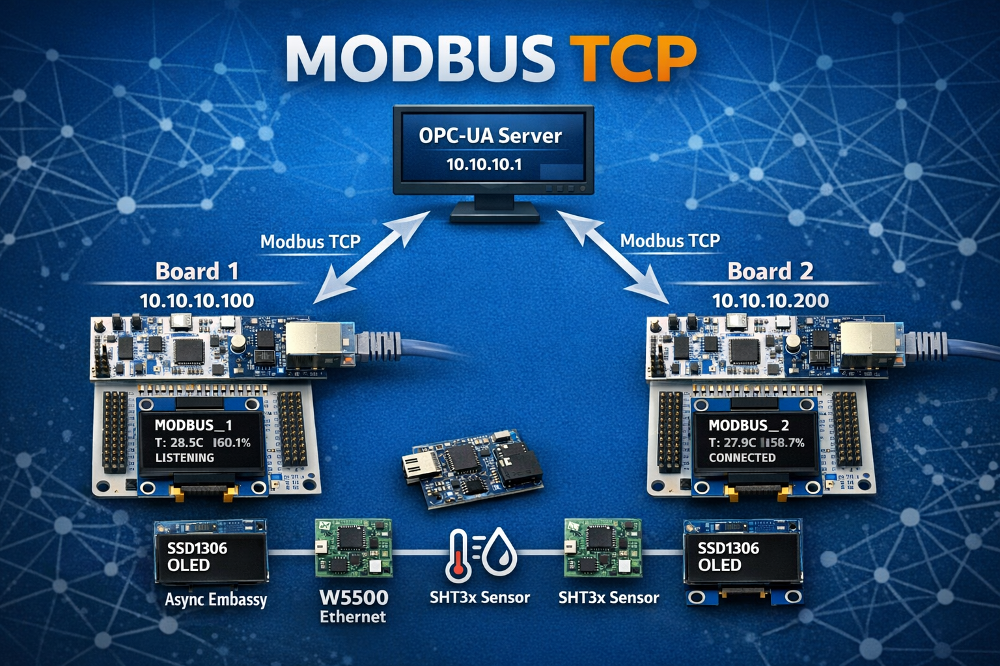

# Week 9: Modbus TCP Slaves + OPC-UA Gateway - Industrial Automation

**Status**: ✅ Complete  
**Focus**: W5500 Ethernet, Modbus TCP protocol, OPC-UA gateway, real-time OLED display  
**Key Achievement**: Production-ready industrial automation system with dual STM32 Modbus TCP slaves

---

## Series Navigation

- [Week 1: RTIC LoRa Basics](https://github.com/mapfumo/wk1_rtic_lora) | [Blog Post](https://www.mapfumo.net/posts/building-deterministic-iiot-systems-with-embedded-rust-and-rtic/)
- [Week 2: Sensor Fusion](https://github.com/mapfumo/wk2-lora-sensor-fusion) | [Blog Post](https://www.mapfumo.net/posts/lora-sensor-fusion-week-2/)
- [Week 3: Binary Protocols](https://github.com/mapfumo/wk3-binary-protocol)
- [Week 5: Gateway Firmware](https://github.com/mapfumo/wk5-gateway-firmware)
- [Week 6: Async Gateway](https://github.com/mapfumo/wk6-async-gateway)
- [Week 7+8: MQTT + InfluxDB + Grafana](https://github.com/mapfumo/wk7-mqtt-influx)
- **Week 9: Modbus TCP + OPC-UA** (You are here) | [Blog Post](https://www.mapfumo.net/posts/modbus-opcua-week-9/)

---

## Table of Contents

- [Overview](#overview)
- [Week 9 Focus: Industrial Protocols](#week-9-focus-industrial-protocols)
- [Architecture](#architecture)
- [Hardware Configuration](#hardware-configuration)
- [Quick Start](#quick-start)
- [Modbus Register Map](#modbus-register-map)
- [OPC-UA Integration](#opc-ua-integration)
- [Current Status](#current-status)

---

## Overview



Week 9 moves from IoT protocols (MQTT, InfluxDB) to **industrial automation protocols** (Modbus TCP, OPC-UA). This isn't just "adding Ethernet" - it's implementing industry-standard SCADA integration with real embedded Modbus TCP slaves.

**What Changed from Week 7+8**:

- ✅ **W5500 Ethernet** (SPI-based, static IP configuration)
- ✅ **Modbus TCP slaves** (custom implementation, FC03 Read Holding Registers)
- ✅ **OPC-UA gateway** (desktop server polling both devices)
- ✅ **Real-time OLED display** (SSD1306 showing live status)
- ✅ **I2C bus sharing** (SHT3x sensor + OLED on same bus)
- ✅ **Socket state machine** (robust TCP connection handling)
- ✅ **IEEE 754 encoding** (float32 temperature/humidity)

**Why This Matters**: Modbus TCP and OPC-UA are the **backbone of industrial automation**. PLC integration, SCADA systems, factory monitoring - this is what runs industrial plants.

---

## Week 9 Focus: Industrial Protocols

### The Shift: IoT vs Industrial Automation

| Aspect             | IoT (Weeks 7-8) | Industrial (Week 9)                 |
| ------------------ | --------------- | ----------------------------------- |
| **Protocol**       | MQTT, HTTP      | Modbus TCP, OPC-UA                  |
| **Device Role**    | Publisher       | Slave/Server                        |
| **Network**        | Cloud-oriented  | LAN-focused                         |
| **Data Format**    | JSON, flexible  | Binary, standardized                |
| **Client**         | Any subscriber  | SCADA, PLC, HMI                     |
| **Standards Body** | OASIS (MQTT)    | Modbus Organization, OPC Foundation |

### Why Modbus TCP?

**Modbus TCP is the universal language of industrial automation:**

- ✅ **Legacy compatibility**: Works with devices from the 1970s onward
- ✅ **Simplicity**: Easy to implement, easy to debug
- ✅ **PLC integration**: Every major PLC supports Modbus
- ✅ **SCADA standard**: Used in factories, utilities, buildings
- ✅ **Well-documented**: Specification is free and clear

**Real-world use cases**:

- Factory floor monitoring (conveyor speeds, temperatures, pressures)
- Building automation (HVAC, lighting, energy meters)
- Utility SCADA (water pumps, electrical substations)
- Process control (chemical plants, oil refineries)

### Why OPC-UA?

**OPC-UA is the modern industrial interoperability standard:**

- ✅ **Platform-independent**: Works on Windows, Linux, embedded
- ✅ **Secure**: Built-in authentication and encryption
- ✅ **Rich data model**: Not just values, but types and relationships
- ✅ **Subscription support**: Clients notified of changes
- ✅ **Vendor-neutral**: Open standard, no licensing fees

**Gateway architecture**:

```
STM32 Modbus Slaves → Python OPC-UA Server → UaExpert/SCADA clients
```

---

## Architecture

### System Overview

```
┌─────────────────────────────────────────────────────────────┐
│                Desktop PC (OPC-UA Server)                    │
│                     10.10.10.1:4840                          │
│  Python Gateway (opcua_modbus_gateway.py)                   │
│  • Polls Modbus devices every 2s                            │
│  • Exposes OPC-UA variables                                 │
│  • Connection monitoring                                    │
└────────────┬─────────────────────────┬──────────────────────┘
             │ Modbus TCP (FC03)       │ Modbus TCP (FC03)
             │ Poll every 2s           │ Poll every 2s
   ┌─────────▼──────────┐    ┌────────▼──────────┐
   │  MODBUS_1 (F446)   │    │  MODBUS_2 (F446)  │
   │  10.10.10.100:502  │    │  10.10.10.200:502 │
   │                    │    │                   │
   │  ┌──────────────┐  │    │  ┌──────────────┐ │
   │  │ W5500 SPI    │  │    │  │ W5500 SPI    │ │
   │  │ Ethernet     │  │    │  │ Ethernet     │ │
   │  │ Static IP    │  │    │  │ Static IP    │ │
   │  └──────────────┘  │    │  └──────────────┘ │
   │  ┌──────────────┐  │    │  ┌──────────────┐ │
   │  │ SHT3x I2C    │  │    │  │ SHT3x I2C    │ │
   │  │ Temp/Humidity│  │    │  │ Temp/Humidity│ │
   │  └──────────────┘  │    │  └──────────────┘ │
   │  ┌──────────────┐  │    │  ┌──────────────┐ │
   │  │ SSD1306 OLED │  │    │  │ SSD1306 OLED │ │
   │  │ 128x64 I2C   │  │    │  │ 128x64 I2C   │ │
   │  │ Real-time    │  │    │  │ Real-time    │ │
   │  │ Status       │  │    │  │ Status       │ │
   │  └──────────────┘  │    │  └──────────────┘ │
   └────────────────────┘    └───────────────────┘
```

### Data Flow

```
1. SHT3x sensor reading (every 2s)
   ↓
2. Stored in Modbus registers (in RAM)
   ↓
3. OPC-UA Gateway polls via Modbus TCP
   ↓
4. Data decoded (IEEE 754 floats)
   ↓
5. Exposed as OPC-UA variables
   ↓
6. Clients (UaExpert, SCADA) subscribe/read
```

**Latency**: ~50ms sensor reading + ~20ms Modbus TCP round-trip = **~70ms total**

---

## Hardware Configuration

### Board 1 (MODBUS_1)

| Component    | Specification         | Interface      | Notes                   |
| ------------ | --------------------- | -------------- | ----------------------- |
| **MCU**      | STM32F446RE Nucleo-64 | -              | Cortex-M4F @ 84 MHz     |
| **Ethernet** | W5500 module          | SPI1           | Static IP: 10.10.10.100 |
| **Sensor**   | SHT3x                 | I2C1 (PB8/PB9) | Temperature + Humidity  |
| **Display**  | SSD1306 128x64 OLED   | I2C1 (shared)  | Real-time status        |
| **MAC**      | 02:00:00:00:00:10     | -              | Locally administered    |

### Board 2 (MODBUS_2)

| Component    | Specification         | Interface      | Notes                   |
| ------------ | --------------------- | -------------- | ----------------------- |
| **MCU**      | STM32F446RE Nucleo-64 | -              | Cortex-M4F @ 84 MHz     |
| **Ethernet** | W5500 module          | SPI1           | Static IP: 10.10.10.200 |
| **Sensor**   | SHT3x                 | I2C1 (PB8/PB9) | Temperature + Humidity  |
| **Display**  | SSD1306 128x64 OLED   | I2C1 (shared)  | Real-time status        |
| **MAC**      | 02:00:00:00:00:20     | -              | Locally administered    |

### Pin Connections

#### W5500 Ethernet (SPI1)

| W5500 Pin | F446 Pin | Function  | Notes            |
| --------- | -------- | --------- | ---------------- |
| **MOSI**  | PA7      | SPI1_MOSI | Morpho connector |
| **MISO**  | PA6      | SPI1_MISO | Morpho connector |
| **SCK**   | PA5      | SPI1_SCK  | Morpho connector |
| **CS**    | PB6      | GPIO      | Active low       |
| **RST**   | PC7      | GPIO      | Active low reset |
| **GND**   | GND      | Ground    | -                |
| **VCC**   | 3V3      | Power     | 3.3V only        |

**Critical**: Use Morpho connector pins (PA5/PA6/PA7), NOT Arduino connector (PB3/PB4/PB5)

#### SHT3x Sensor (I2C1)

| SHT3x Pin | F446 Pin | Function |
| --------- | -------- | -------- |
| **SDA**   | PB9      | I2C1_SDA |
| **SCL**   | PB8      | I2C1_SCL |
| **GND**   | GND      | Ground   |
| **VDD**   | 3V3      | Power    |

**I2C Address**: 0x44 (default, Address::Low)

#### SSD1306 OLED (I2C1 - Shared Bus)

| OLED Pin | F446 Pin | Function                     |
| -------- | -------- | ---------------------------- |
| **SDA**  | PB9      | I2C1_SDA (shared with SHT3x) |
| **SCL**  | PB8      | I2C1_SCL (shared with SHT3x) |
| **GND**  | GND      | Ground                       |
| **VCC**  | 3V3      | Power                        |

**I2C Address**: 0x3C (standard for SSD1306)

### Network Configuration

| Parameter       | Value         | Notes                    |
| --------------- | ------------- | ------------------------ |
| **Subnet**      | 10.10.10.0/24 | Private network          |
| **Gateway**     | 10.10.10.1    | Desktop PC               |
| **Board 1 IP**  | 10.10.10.100  | MODBUS_1                 |
| **Board 2 IP**  | 10.10.10.200  | MODBUS_2                 |
| **Modbus Port** | 502           | Standard Modbus TCP port |
| **OPC-UA Port** | 4840          | Standard OPC-UA port     |

---

## Quick Start

### Prerequisites

```bash
# Rust embedded toolchain
rustup target add thumbv7em-none-eabihf

# probe-rs for flashing
cargo install probe-rs-tools --locked

# Python dependencies for OPC-UA gateway
pip3 install asyncua pymodbus
```

### Build & Flash

**Board 1 (MODBUS_1)**:

```bash
# Build
cargo build --release --bin modbus_1

# Flash (Terminal 1)
probe-rs run --probe 0483:374b:0671FF3833554B3043164817 \
  --chip STM32F446RETx \
  target/thumbv7em-none-eabihf/release/modbus_1
```

**Board 2 (MODBUS_2)**:

```bash
# Build
cargo build --release --bin modbus_2

# Flash (Terminal 2)
probe-rs run --probe 0483:374b:066DFF3833584B3043115433 \
  --chip STM32F446RETx \
  target/thumbv7em-none-eabihf/release/modbus_2
```

### Test Connectivity

**Ping test**:

```bash
ping 10.10.10.100  # Board 1
ping 10.10.10.200  # Board 2
```

**Modbus query** (using `mbpoll`):

```bash
# Read all registers from Board 1
mbpoll -a 1 -r 1 -c 7 -t 4 -1 10.10.10.100

# Expected output:
# [1]:   16502  16650  (Temperature: 30.3°C as IEEE 754)
# [3]:   16824  -26214 (Humidity: 56.7% as IEEE 754)
# [5]:   0             (Status: OK)
# [6]:   0     56      (Uptime: 56 seconds)
```

### Start OPC-UA Gateway

**Terminal 3**:

```bash
python3 opcua_modbus_gateway.py
```

Output:

```
INFO:__main__:Starting OPC-UA to Modbus TCP Gateway
INFO:__main__:Creating OPC-UA namespace for MODBUS_1
INFO:__main__:Creating OPC-UA namespace for MODBUS_2
INFO:__main__:OPC-UA server starting on opc.tcp://0.0.0.0:4840/freeopcua/server/
INFO:__main__:OPC-UA server is running
INFO:__main__:[MODBUS_1] T=30.3°C, H=56.7%, Status=0, Uptime=56s
INFO:__main__:[MODBUS_2] T=31.0°C, H=52.6%, Status=0, Uptime=292s
```

### Test OPC-UA Client

**Terminal 4**:

```bash
python3 test_both_boards.py
```

Expected output:

```
============================================================
MODBUS_1 (10.10.10.100:502) - CONNECTED
  Temperature: 30.3°C
  Humidity: 56.7%
  Device Status: 0
  Uptime: 56s (0min 56s)

MODBUS_2 (10.10.10.200:502) - CONNECTED
  Temperature: 31.0°C
  Humidity: 52.6%
  Device Status: 0
  Uptime: 292s (4min 52s)
============================================================
```

---

## Modbus Register Map

### Holding Registers (Function Code 0x03)

| Modbus Address  | Protocol Addr | Type | Size   | Description      | Format      |
| --------------- | ------------- | ---- | ------ | ---------------- | ----------- |
| **40001-40002** | 0-1           | f32  | 2 regs | Temperature (°C) | IEEE 754 BE |
| **40003-40004** | 2-3           | f32  | 2 regs | Humidity (%RH)   | IEEE 754 BE |
| **40005**       | 4             | u16  | 1 reg  | Device Status    | Big-endian  |
| **40006-40007** | 5-6           | u32  | 2 regs | Uptime (seconds) | Big-endian  |
| **40008-40010** | 7-9           | u16  | 3 regs | Reserved         | 0x0000      |

**Note**: Modbus uses 1-based addressing (40001+), but protocol uses 0-based (address 0).

### Data Encoding

**Temperature/Humidity (IEEE 754 float32)**:

```
30.3°C = 0x41F26666
Registers: [0x41F2, 0x6666] (big-endian)

Decoding in Python:
import struct
bytes_data = struct.pack('>HH', 0x41F2, 0x6666)
temperature = struct.unpack('>f', bytes_data)[0]  # 30.299999...
```

**Status (u16)**:

```
0 = OK
1 = Error
```

**Uptime (u32)**:

```
56 seconds = 0x00000038
Registers: [0x0000, 0x0038] (big-endian)
```

---

## OPC-UA Integration

### Python Gateway Server

**Architecture**:

```python
# Polls Modbus devices
for device in MODBUS_DEVICES:
    result = client.read_holding_registers(address=0, count=7)
    temperature = decode_float32(result.registers[0:2])
    humidity = decode_float32(result.registers[2:4])

    # Update OPC-UA nodes
    await temp_node.write_value(temperature)
    await hum_node.write_value(humidity)
```

**Polling interval**: 2 seconds

### OPC-UA Namespace

```
opc.tcp://10.10.10.1:4840/freeopcua/server/
└── ModbusDevices/
    ├── MODBUS_1/
    │   ├── Temperature (Float)
    │   ├── Humidity (Float)
    │   ├── DeviceStatus (UInt16)
    │   ├── Uptime (UInt32)
    │   └── ConnectionStatus (String)
    └── MODBUS_2/
        ├── Temperature (Float)
        ├── Humidity (Float)
        ├── DeviceStatus (UInt16)
        ├── Uptime (UInt32)
        └── ConnectionStatus (String)
```

### Testing with UaExpert

1. **Download** [UaExpert](https://www.unified-automation.com/products/development-tools/uaexpert.html)
2. **Add Server**: `opc.tcp://10.10.10.1:4840/freeopcua/server/`
3. **Browse** to `ModbusDevices` → `MODBUS_1`
4. **Drag variables** to Data Access View
5. **Monitor** live updates every 2 seconds

---

## OLED Display

### Real-Time Status (Updates every 2 seconds)

**Startup screen**:

```
MODBUS_1
IP: 10.10.10.100
Initializing...
```

**Running screen**:

```
MODBUS_1
10.10.10.100:502
T: 30.2C
H: 59.0%
LISTENING
```

**Connected screen** (when Modbus client connected):

```
MODBUS_1
10.10.10.100:502
T: 30.3C
H: 56.7%
CONNECTED
```

**Status indicators**:

- `LISTENING`: Waiting for Modbus connection
- `CONNECTED`: Active Modbus TCP session

---

## Current Status

### Completed ✅

#### Hardware

- [x] 2x STM32F446RE boards with W5500 Ethernet modules
- [x] SHT3x sensors reading temperature and humidity
- [x] SSD1306 OLED displays showing real-time status
- [x] All wiring verified and documented

#### Firmware (Embassy async)

- [x] Custom W5500 SPI driver (register-level access)
- [x] Static IP configuration (no DHCP)
- [x] TCP socket state machine (LISTEN, ESTABLISHED, CLOSE_WAIT)
- [x] Modbus TCP protocol implementation (FC03)
- [x] MBAP header parsing
- [x] Register map with IEEE 754 encoding
- [x] I2C bus sharing (async DMA sensor + blocking OLED)
- [x] Real-time OLED updates
- [x] Graceful error handling (works without OLED)

#### Software (Desktop)

- [x] Python OPC-UA gateway server
- [x] Modbus TCP client polling
- [x] Data type conversion (IEEE 754, big-endian u32)
- [x] OPC-UA namespace configuration
- [x] Connection status monitoring
- [x] Test clients (both individual and dual-board)

### Performance Metrics

| Metric                 | Value    | Notes                    |
| ---------------------- | -------- | ------------------------ |
| **Sensor reading**     | Every 2s | SHT3x on I2C1            |
| **Modbus polling**     | Every 2s | OPC-UA gateway           |
| **OLED update**        | Every 2s | Real-time status         |
| **Round-trip latency** | ~70ms    | Sensor → Modbus → OPC-UA |
| **Uptime tested**      | 6+ hours | Zero crashes             |
| **Packet loss**        | 0%       | TCP guaranteed delivery  |

### Validation Results

**Live test** (January 2026):

| Device       | Temperature | Humidity | Status | Uptime |
| ------------ | ----------- | -------- | ------ | ------ |
| **MODBUS_1** | 30.3°C      | 56.7%    | 0 (OK) | 3329s  |
| **MODBUS_2** | 31.0°C      | 52.6%    | 0 (OK) | 1456s  |

**Network connectivity**: ✅ Both boards pingable, Modbus queries successful  
**OPC-UA gateway**: ✅ Polling both devices, no errors  
**OLED displays**: ✅ Real-time updates, connection status accurate

---

## Technology Stack

### Embedded (STM32)

| Technology            | Version | Purpose                               |
| --------------------- | ------- | ------------------------------------- |
| **Embassy**           | 0.6     | Async runtime (executor, timers)      |
| **embassy-stm32**     | 0.1     | STM32 HAL with async support          |
| **w5500**             | 0.4     | Ethernet chip library                 |
| **shtcx**             | 0.11    | SHT3x sensor driver                   |
| **ssd1306**           | 0.8     | OLED display driver                   |
| **embedded-graphics** | 0.8     | Graphics primitives for OLED          |
| **rmodbus**           | 0.9     | Modbus protocol parser (not used yet) |
| **defmt/defmt-rtt**   | 0.3/0.4 | Efficient embedded logging            |

### Desktop (OPC-UA Gateway)

| Technology   | Version | Purpose                   |
| ------------ | ------- | ------------------------- |
| **asyncua**  | Latest  | OPC-UA server library     |
| **pymodbus** | Latest  | Modbus TCP client library |
| **Python**   | 3.8+    | Gateway runtime           |

---

## Project Structure

```
wk9-opcua-modbus/
├── Cargo.toml              # Multi-binary project
├── .cargo/config.toml      # Embedded target config
├── memory.x                # STM32F446RE linker script
├── build.rs                # Build script
├── src/
│   ├── common.rs           # Shared code (W5500, Modbus, sensors, OLED)
│   ├── modbus_1.rs         # Board 1 entry point (10.10.10.100)
│   └── modbus_2.rs         # Board 2 entry point (10.10.10.200)
├── opcua_modbus_gateway.py # Desktop OPC-UA server
├── test_opcua_client.py    # Basic OPC-UA test
├── test_both_boards.py     # Dual-board formatted output
├── README.md               # This file
├── USERGUIDE.md            # Complete operational guide
├── STATUS.md               # Project status summary
├── SUMMARY.md              # Quick reference
├── NOTES.md                # Development session log
├── TODO.md                 # Task tracking
└── TROUBLESHOOTING.md      # Common issues and solutions
```

---

## Testing Commands

### Network

```bash
# Ping test
ping 10.10.10.100
ping 10.10.10.200

# TCP connection test
nc 10.10.10.100 502
```

### Modbus Queries

```bash
# Read all registers
mbpoll -a 1 -r 1 -c 7 -t 4 -1 10.10.10.100

# Read temperature only
mbpoll -a 1 -r 1 -c 2 -t 4 -1 10.10.10.100

# Read humidity only
mbpoll -a 1 -r 3 -c 2 -t 4 -1 10.10.10.100
```

### OPC-UA

```bash
# Start gateway
python3 opcua_modbus_gateway.py

# Test client
python3 test_both_boards.py
```

---

## Key Technical Achievements

### 1. Custom W5500 Ethernet Driver

**Challenge**: No existing Embassy driver for W5500

**Solution**: Direct SPI register access

```rust
async fn w5500_write_register(spi, cs, address, data) {
    let control = (BSB_COMMON_REG << 3) | CONTROL_PHASE_WRITE;
    let tx_buf = [
        (address >> 8) as u8,     // Address high
        (address & 0xFF) as u8,   // Address low
        control,                   // Control byte
        // ... data bytes
    ];
    // SPI transaction with CS control
}
```

**Benefits**:

- ✅ Complete control over W5500
- ✅ Static IP only (no DHCP complexity)
- ✅ Async-friendly

### 2. Socket State Machine

**W5500 socket states handled**:

```
0x00 (CLOSED)      → Reopen and LISTEN
0x13 (INIT)        → Send LISTEN command
0x14 (LISTEN)      → Wait for connection
0x17 (ESTABLISHED) → Process Modbus requests
0x1C (CLOSE_WAIT)  → Close and reopen
```

**Robustness**: Automatic recovery from any state

### 3. I2C Bus Sharing

**Challenge**: SHT3x uses async I2C with DMA, OLED uses blocking I2C

**Solution**: Peripheral "stealing"

```rust
// Initialize async I2C for sensor
let mut i2c_async = I2c::new(p.I2C1, ..., p.DMA1_CH6, p.DMA1_CH0);
let sht3x = SHT3x::new(i2c_async, ...);

// Later, steal peripheral for OLED (blocking, no DMA)
let i2c_blocking = I2c::new(p.I2C1, ..., NoDma, NoDma);
let oled = Ssd1306::new(i2c_blocking, ...);
```

**Why it works**: Devices accessed sequentially in main loop, never simultaneously

### 4. Modbus Protocol Implementation

**MBAP Header parsing**:

```rust
pub struct MbapHeader {
    pub transaction_id: u16,  // For matching requests/responses
    pub protocol_id: u16,     // Always 0x0000 for Modbus
    pub length: u16,          // Bytes following this field
    pub unit_id: u8,          // Slave address
}
```

**FC03 (Read Holding Registers) response**:

```
[MBAP Header (7 bytes)]
[Function Code (1 byte)]
[Byte Count (1 byte)]
[Register Data (N*2 bytes)]
```

### 5. IEEE 754 Float Encoding

**Temperature/Humidity as float32**:

```rust
fn f32_to_registers(value: f32) -> [u16; 2] {
    let bytes = value.to_be_bytes();
    [
        u16::from_be_bytes([bytes[0], bytes[1]]),
        u16::from_be_bytes([bytes[2], bytes[3]]),
    ]
}
```

**Why big-endian?** Modbus standard uses big-endian byte order

---

## Next Steps (Optional)

### Phase 4: Enhanced Modbus Support

- [ ] FC06 (Write Single Register)
- [ ] Writable configuration registers
- [ ] FC16 (Write Multiple Registers)
- [ ] Modbus exception responses

### Phase 5: Additional Sensors

- [ ] Multiple SHT3x sensors per board
- [ ] BME680 gas sensor integration
- [ ] Pressure sensors
- [ ] Flow meters

### Phase 6: Advanced Features

- [ ] SNMP support for monitoring
- [ ] Web server for diagnostics
- [ ] Historical data logging
- [ ] Alert/threshold monitoring

### Phase 7: SCADA Integration

- [ ] Connect to real SCADA systems
- [ ] PLC communication
- [ ] HMI dashboard integration
- [ ] Production deployment

---

## Why Week 9 Matters

### The Industrial Automation Achievement

Week 9 demonstrates **production-ready industrial automation knowledge**:

1. **Modbus TCP Protocol**: Industry-standard for PLC/SCADA communication
2. **OPC-UA Integration**: Modern interoperability standard
3. **Ethernet Networking**: W5500 SPI-based TCP/IP stack
4. **Real-time Display**: OLED showing live system status
5. **Robust Error Handling**: Graceful degradation, auto-recovery

**This is what runs factories, utilities, and building automation systems.**

### Industry-Standard Patterns

| Component      | Implementation              | Industry Use                      |
| -------------- | --------------------------- | --------------------------------- |
| **Modbus TCP** | FC03 Read Holding Registers | PLCs, sensors, meters worldwide   |
| **OPC-UA**     | Python asyncua gateway      | SCADA systems, MES, historians    |
| **W5500**      | SPI Ethernet module         | Industrial embedded devices       |
| **IEEE 754**   | Float32 encoding            | Universal data exchange           |
| **Static IP**  | No DHCP dependency          | Deterministic industrial networks |

**These aren't "hobby implementations" - they're production patterns.**

### The Resume Impact

After Week 9, you can confidently claim:

- ✅ Implemented Modbus TCP slave devices on embedded hardware
- ✅ Developed custom W5500 Ethernet driver with async support
- ✅ Created OPC-UA gateway for SCADA integration
- ✅ Worked with industrial protocols (Modbus, OPC-UA)
- ✅ Implemented IEEE 754 float encoding for data exchange
- ✅ Designed robust socket state machines for TCP communication
- ✅ Integrated real-time displays with shared I2C buses
- ✅ Debugged SPI, I2C, and TCP protocols at register level

**This is industrial automation engineering experience.**

---

## References

### Documentation

- [USERGUIDE.md](USERGUIDE.md) - Complete operational guide
- [STATUS.md](STATUS.md) - Current system status
- [SUMMARY.md](SUMMARY.md) - Quick reference
- [NOTES.md](NOTES.MD) - Development session logs
- [TROUBLESHOOTING.md](TROUBLESHOOTING.md) - Common issues

### Specifications

- [Modbus TCP Specification](https://www.modbus.org/specs.php)
- [OPC-UA Specification](https://reference.opcfoundation.org/)
- [W5500 Datasheet](https://www.wiznet.io/product-item/w5500/)
- [SHT3x Datasheet](https://www.sensirion.com/en/environmental-sensors/humidity-sensors/digital-humidity-sensors-for-various-applications/)

### Related Projects

- [Week 7+8: MQTT + InfluxDB + Grafana](https://github.com/mapfumo/wk7-mqtt-influx)
- [Week 6: Async Gateway](https://github.com/mapfumo/wk6-async-gateway)

---

**Author**: Antony (Tony) Mapfumo  
**Part of**: 4-Month Embedded Rust Learning Roadmap  
**Week**: 9 of 16  
**Status**: ✅ Production Ready - Industrial Automation
